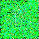
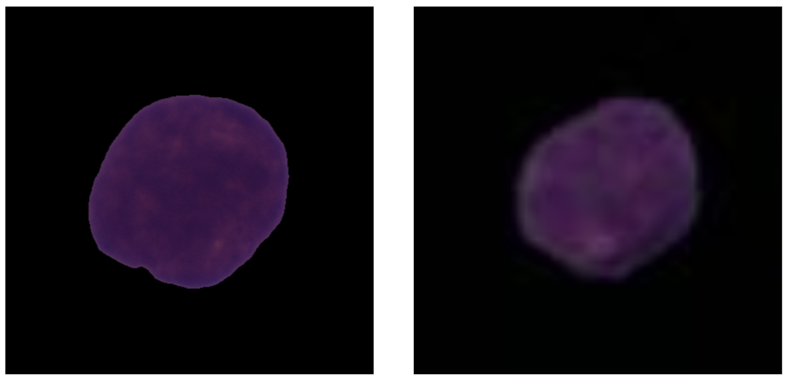

# Expanding Cancer Cell Dataset using Diffusion Models

## Overview
This project focuses on generating synthetic cancer cell images using diffusion models. The aim is to expand the dataset and improve classification accuracy in cancer cell image classification tasks. The synthetic images are created through the application of diffusion models, providing an augmented dataset for training deep learning models.

## Key Features
- Generation of synthetic cancer cell images.
- Utilization of diffusion models for image synthesis.
- Dataset expansion to enhance classification accuracy.

## Visuals

 
The video above shows the Diffusion Model learning to generate images with every epoch.
  

 

The image above shows the comparison between a real image and a synthetic image.
The image on the left is a real image and the image on the right is a generated image.
Note that the real image has a resolution of 450x450 and the generated image has a resolution of 32x32 (scaled up for illustration)
